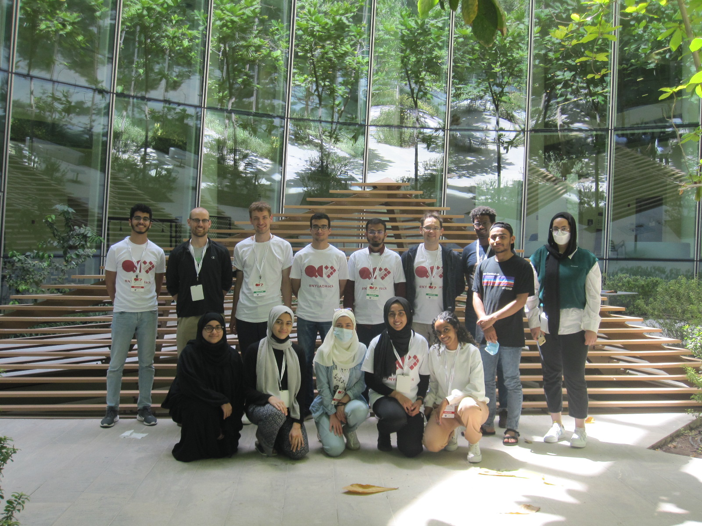

# MediQal (Team22)

Our solution uses quantum annealing to solve Traveling Salesperson Problems to efficiently route mobile healthcare vehicles. We utilize both classical and quantum solvers for this task. Our quantum solutions are obtained by submitting QUBO problems to the DWave quantum annealers via Amazon Braket.

<a href = "https://docs.google.com/presentation/d/1xttMPEMyEMe38c13a5HV48R3ZdQXod-m/edit">Presentation</a>

## Team Members


## Mentors
Alexandar Degner,  Media University of Applied Sciences Munich, Germany

Pawel Gora , Quantum AI Foundation, Poland

Mohammad Aamir Sohail , University of Michigan, USA
## Hackers
Chaimae Abouzahir, New York University Abu Dhabi, UAE

Fatima Alzahra Maaroouf, Lebanese American University, Lebanon

Hamza Boudouche, Mohammed 5 University, Morocco

Malak Mansour, New York University Abu Dhabi, UAE

Mariam Alsafi, Khalifa University, UAE

Sashank Neupane, New York University Abu Dhabi, UAE

Tasnim Ahmed, New York University Abu Dhabi, UAE

Teague Tomesh, Princeton University, USA

Tiemar Semere Berhe, Khalifa University, UAE

Yaphet Elias Weldegebriel, Khalifa University, UAE

Ziad Mohamed Hassan, New York University Abu Dhabi, UAE

## Problem Description

Mobile medical services (e.g. ambulances, medical supply delivery, lab tests) contribute significantly to greenhouse gases and environmental pollution. For example, it is estimated that an average of 31.3kg of carbon dioxide (CO2) is produced per ambulance [1]. The rapid advancement in medical technologies have led to an increase in life expectancy of more than 6 years between 2000 and 2019 [2] resulting in an increase of ageing societies. Thus, it is expected that more people will require mobile medical services in the future. From an algorithmic point of view, the problem of optimal vehicle routing is NP-hard (it is a similar problem to the well-known Vehicle Routing Problem)[3], which means that most likely it would be impossible to find the optimal routing solution for large fleets of emergency vehicles using classical approaches. There is hope that quantum computing will give an advantage in this area especially for large scale problems (i.e. hundreds of vehicles and thousands of patients). We have concluded that optimising routing of medical vehicles is an important social and environmental challenge where the usage of quantum computing is justified, and decided to focus on this topic during the hackathon.

# Getting Started

Clone this repository: https://github.com/hamza-boudouche/NYUAD-2022

Install all the requirements for quantum algorithm:

`pip install -r requirements.txt`

Go to NYUAD-2022/team22 folder

`cd NYUAD-2022/team22`

Install nodejs

<a href= "https://nodejs.org/en/download/">NodeJS</a>

Install all the requirements with

`npm install`

Run it on your machine

`npm start`

After starting the website on a localhost server, you can find a website where you can interactively call for a mediQal request. A new node in your location will be created, and the path will be adapted in real time using quantum annealing.


## Explanation of Quantum Algorithm

The code for constructing the problem QUBO and finding a solution via classical or quantum annealing is contained in `vrp_qubo.py`. All that is needed as input is an `edge_list` which is passed into the `wrapper()` function.

As an example, a simple input graph may be represented by the edge list:

```python
edge_list = [(0,1,{'weight':4.7}), (1,2,{'weight':10.9}), ...]
```

Calling this function will 
1. Construct the problem QUBO
2. Find a solution via classical or quantum annealing
3. Return the shortest found path and the cost of traversing that path:

```python
[2,1,5,2,...], 32
```
are the order of coordinates and the total cost of the path, which will be the output of the `wrapper()` function.

## Resources
Our QUBO formulation of the problem was adapted from:
> Borowski, M. et al. (2020). [New Hybrid Quantum Annealing Algorithms for Solving Vehicle Routing Problem](https://link.springer.com/chapter/10.1007/978-3-030-50433-5_42#citeas). In: Computational Science – ICCS 2020. ICCS 2020. Lecture Notes in Computer Science, vol 12142. Springer, Cham. https://doi.org/10.1007/978-3-030-50433-5_42

Access to the DWave quantum annealers was made possible by:
- [Amazon Braket](https://aws.amazon.com/braket/quantum-computers/dwave/)
- [qBraid](https://account.qbraid.com)

We utilized the following APIs:
- [OpenStreetMap](https://www.openstreetmap.org/copyright): OpenStreetMap® is open data, licensed under the Open Data Commons Open Database License (ODbL) by the OpenStreetMap Foundation (OSMF).
- [Leaflet](https://leafletjs.com)
- [Auth0](https://auth0.com)

---

## References

[1] Sheldon, A., 2022. Scoping ambulance emissions: recommendations for reducing engine idling time. <a href="https://www.paramedicpractice.com/features/article/scoping-ambulance-emissions-recommendations-for-reducing-engine-idling-time#:~:text=An%20average%20of%2031.3%20kg,emissions%20and%20public%20health%20emerge"> [online]</a> Journal Of Paramedic Practice. [Accessed 1 April 2022].

[2] Who.int. n.d. GHE: Life expectancy and healthy life expectancy. <a href="https://www.who.int/data/gho/data/themes/mortality-and-global-health-estimates/ghe-life-expectancy-and-healthy-life-expectancy"> [online]</a> [Accessed 1 April 2022].

[3] Kumar, S. and Panneerselvam, R., 2012. A Survey on the Vehicle Routing Problem and Its Variants. Intelligent Information Management, 04(03), pp.66-74.