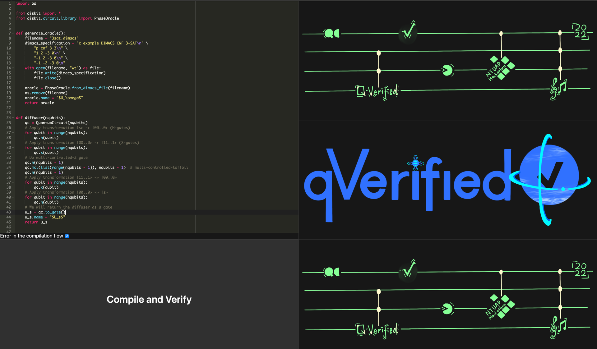

# qVerified - Verified Quantum Circuit Compilation
## NYUAD Hackathon for social good in the arab world

### Team

 - Lukas Burgholzer (Mentor), Johannes Kepler University Linz, Austria
 - Abdelkhalik Aljuneidi (Mentor), Takalam L.T.D., Palestine
 - Geon Tack Lee (Hacker), New York University Abu Dhabi, UAE
 - Karim Wen Rahme (Hacker), New York University Abu Dhabi, UAE
 - Gayatri Tyagi (Hacker), New York University Tandon, UAE
 - Elijah Whittle (Hacker), New York University Tandon, UAE
 - Omar AlRemeithi (Hacker), Khalifa University, UAE
 - Silvey Yu (Hacker), New York University Shanghai, China
 - Wen Rahme (Hacker), New York University Abu Dhabi, UAE
 - Iheb Nassim Aouadj (Hacker), Higher National School of Computer Science Algiers, Algeria

### Getting started

Clone this repository
```console 
git clone https://github.com/burgholzer/NYUAD-2022
```
Our team's contribution is in the `team18` folder. So move there
```console
cd NYUAD-2022/team18
```
A minimum working example showcasing our contributions can be found in the `main.py` file.
To get this working, create and activate a new virtual environment for the project:
```console
python3 -m venv venv
. venv/bin/activate
```
Install the requirements from the `requirements.txt` file:
```console 
pip install -r requirements.txt
```
Then execute the Python script
```console 
python3 main.py
```
This should yield:
```console
Generating profile for verification ...
... generated profile
Generating application circuit ...
... generated application circuit
Compiling and verifying the circuit ...
... compiled circuit is equivalent to original circuit: True
Simulating the resulting circuit and saving histogram ...
... done
Compiling and verifying the circuit and introducing an error ...
... compiled circuit is equivalent to original circuit: False
Simulating the resulting circuit and saving histogram ...
... done
```

## Detailed list of contributions
We developed an easy-to-use web tool that allows to verify that quantum circuits have been correctly compiled.
To this end, we
 - Improved the quantum circuit equivalence checking tool MQT QCEC by developing a dedicated profile for verifying compilation results (see `generate_profile.py`)
 - Implemented a flow for using the generated profile to automatically verify the compilation of a circuit (see `backend/app/compile_and_verify`)
 - Designed a web application for easily using the developed methods, see the screenshot below



## Technologies used
 - IBM Qiskit: Quantum SDK
 - MQT QCEC: A tool for quantum circuit equivalence checking
 - Flask: Backend for the web application
 - React: Frontend for the web application
